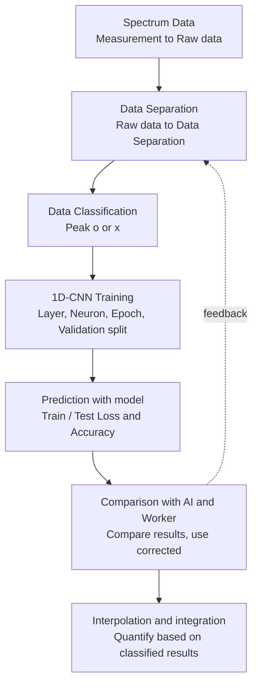

# SERSPeakFinder

A GUI tool to **quantify nanoplastic components from Raman spectra**.  
It covers the full pipeline from raw measurement data through peak classification, deep-learning prediction, worker comparison, and integration-based quantification.

[한국어](README.md) | [English](README.en.md)

## Goal

From Raman Spectrum raw data acquired by measurement, detect peak presence and quantify targets based on the classified results.



## Pipeline

### 1. Spectrum Data

Raw mapping file (data frame) layout:

| Field | Content |
|---|---|
| Header col 1 | X |
| Header col 2 | Y |
| Header col 3+ | Wavelength |
| Data col 1 | x axis |
| Data col 2 | y axis (Mapping) |
| Data col 3+ | Intensity |


### 2. Data Separation (`Splite Plot Data`)

Split raw data into per-coordinate spectrum files (`*_ (x_y).csv`).


### 3. Data Classification (`Plot Classifier`)

Manually label peak presence while viewing spectra. (`O`/`A` = peak, `X`/`D` = no peak)


### 4. 1D-CNN Training (`CNN Training`)

Train a PyTorch binary classifier (CUDA when available; typically ~30 minutes depending on settings).

**Model architecture (example input size = 1336)**

```
1336 → 128 → 64 → 32 → 1
```

- Linear + ReLU + Dropout + Sigmoid
- Output in `[0, 1]` for binary peak classification
- Monitor Train/Test Loss & Accuracy during training


### 5. Prediction (`Run (Peak Detection)`)

Predict peak presence with a trained `.pth` model.  
Shows best accuracy and total / positive / negative counts.


### 6. Comparison with AI and Worker (`Compare with Prev. Plot`)

Compare worker labels with model predictions and export a report.


### 7. Interpolation and integration (`Interpolation`)

Interpolate and integrate the peak region for quantification.

| Item | Settings |
|---|---|
| Fourier Transform | Freq. Cutoff |
| Savitzky–Golay Filter | window_length, polyorder |
| Linear Interpolation | center wavelength, span (±) |
| Output | Integration value → Quantification |


## Model Performance (example)

Matching rate vs worker labels on `small ng samp 4~10` (400 each, 2800 total):

| Model | Matching rate (Sum) |
|---|---|
| M4 | 96.07% |
| M5 | **97.00%** |

- M0: initial model
- M5: updated model (matching rate ≈ 97%)

Pretrained weights (`*.pth`) are **not included in this repository**. Keep them on local disk or NAS.

## Requirements

- Windows 10+
- Python 3.8+
- `PyQt6`, `numpy`, `pandas`, `torch`, `scipy`, `matplotlib`, `scikit-learn`, `natsort`, `torchsummary`, `qbstyles`

## Install & Run

```bash
python -m venv .venv
.venv\Scripts\activate
pip install PyQt6 numpy pandas torch scipy matplotlib scikit-learn natsort torchsummary qbstyles
python main.py
```

Paths and hyperparameters are stored in `config.ini` (`split` / `classify` / `train` / `detect` / `compare` / `integration`).

## Key Files

| File | Description |
|---|---|
| `main.py` | GUI entry point and tab logic |
| `ui_main.py` / `ui_main.ui` | Qt Designer UI |
| `touch_training.py` | Dataset, model, train/eval |
| `matplotlibwidget.py` | Spectrum plot widget |
| `config.ini` | Paths and parameters |
| `screenshot/` | Screenshots extracted from `raman_spectrum.pptx` |
| `raman_spectrum.pptx` | Workflow / model-update notes |

## Screenshot Index

| File | Content |
|---|---|
| `01_spectrum_raw_dataframe.png` | Raw mapping dataframe |
| `02_data_separation_files.png` | Per-coordinate CSV files |
| `03_plot_classifier.png` | Manual peak labeling UI |
| `04_model_summary.png` | Model layer summary |
| `06_cnn_training_gui.png` | Training UI (loss/accuracy) |
| `07_prediction.png` | Peak detection UI |
| `08_compare_ai_worker.png` | AI vs worker comparison UI |
| `09_interpolation_methods.png` | SG filter + linear interpolation |
| `11_interpolation_gui.png` | Interpolation tab UI |

## Reference

- `raman_spectrum.pptx` — Raman spectrum / Model update & Interpolation (2025.02.03, Lee Jeong-su)
