# SERSPeakFinder

라만(Raman) 스펙트럼으로부터 **나노플라스틱(Nano plastic) 성분을 정량화**하기 위한 분석 GUI입니다.  
측정 원본 → 데이터 분리 → 피크 분류 → 딥러닝 학습/예측 → 작업자 결과 비교 → 보간·적분까지 한 흐름으로 처리합니다.

[한국어](README.md) | [English](README.en.md)

## 목적

Measurement로 얻은 Raman Spectrum raw data에서 피크 유무를 판별하고, 분류 결과를 바탕으로 정량(적분)합니다.

```
Measurement → Raw data
     → Data Separation
     → Data Classification (Peak O / X)
     → 1D-CNN Training
     → Prediction (with model)
     → Comparison with AI and Worker
     → Interpolation and integration → Quantification
```

## 파이프라인

### 1. Spectrum Data

원본 mapping 파일(data frame) 구조:

| 구분 | 내용 |
|---|---|
| Header 1열 | X |
| Header 2열 | Y |
| Header 3열~ | Wavelength |
| 데이터 1열 | x axis |
| 데이터 2열 | y axis (Mapping) |
| 데이터 3열~ | Intensity |

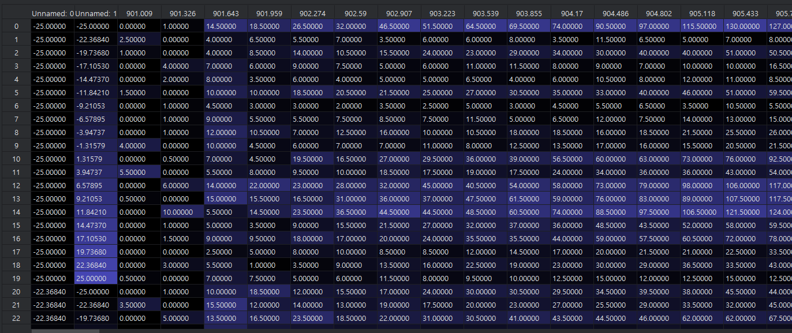

### 2. Data Separation (`Splite Plot Data`)

Raw data를 좌표별 개별 스펙트럼 파일(`*_ (x_y).csv`)로 분리합니다.

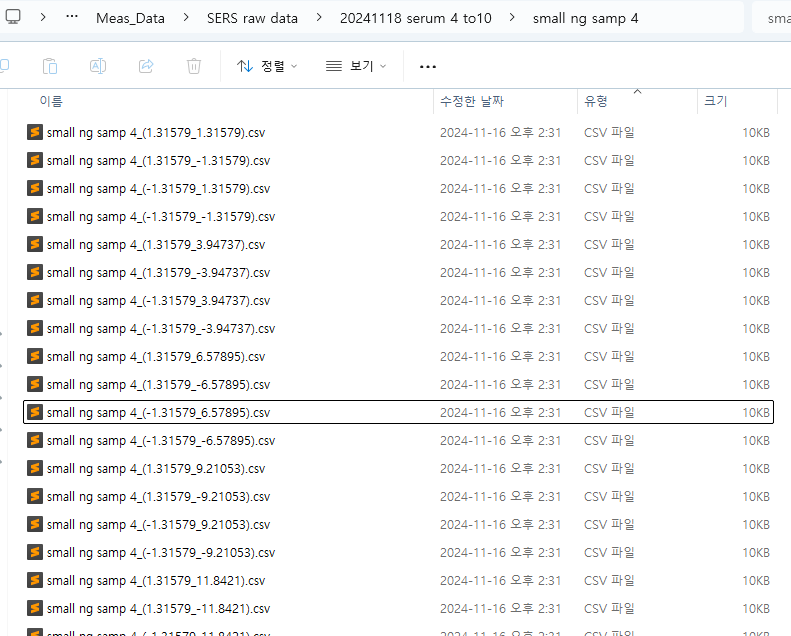

### 3. Data Classification (`Plot Classifier`)

스펙트럼을 보며 피크 유무를 수동 분류합니다. (`O`/`A` = peak, `X`/`D` = no peak)

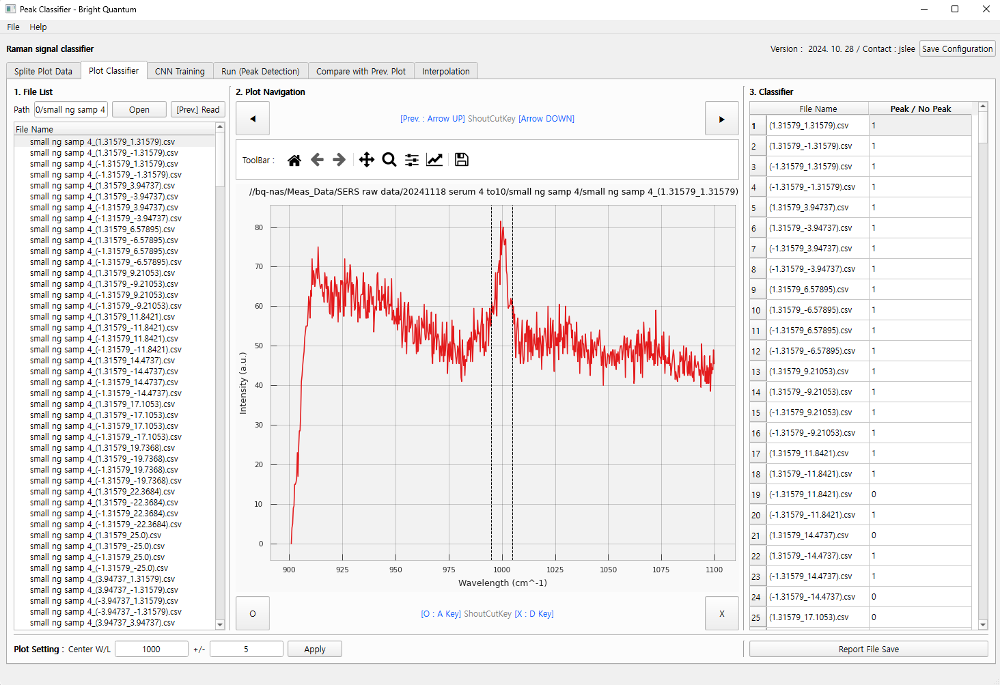

### 4. 1D-CNN Training (`CNN Training`)

PyTorch 기반 이진 분류 모델을 학습합니다. (GPU/CUDA 사용 가능, 환경에 따라 약 30분 소요)

**모델 구조 (예시 input size = 1336)**

```
1336 → 128 → 64 → 32 → 1
```

- Linear + ReLU + Dropout + Sigmoid
- 출력 `[0, 1]` → Peak 유무 이진 분류
- 학습 중 Train/Test Loss & Accuracy 모니터링

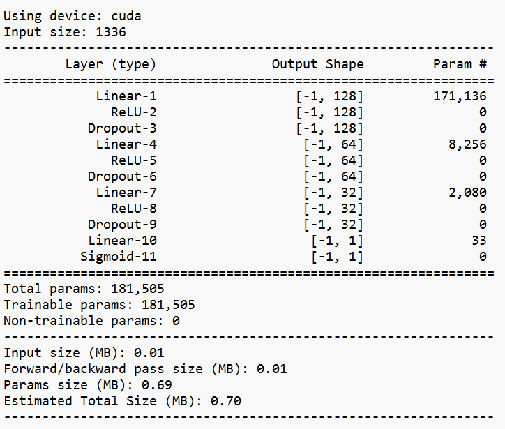

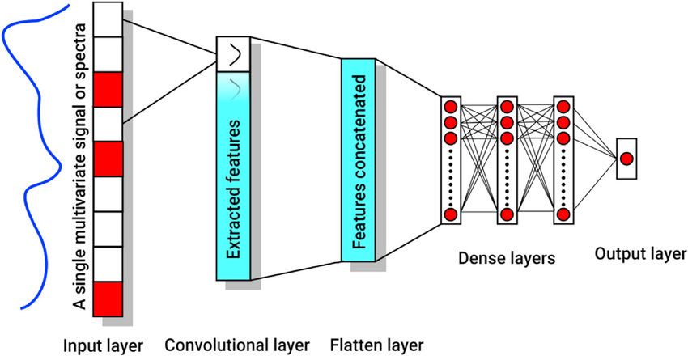

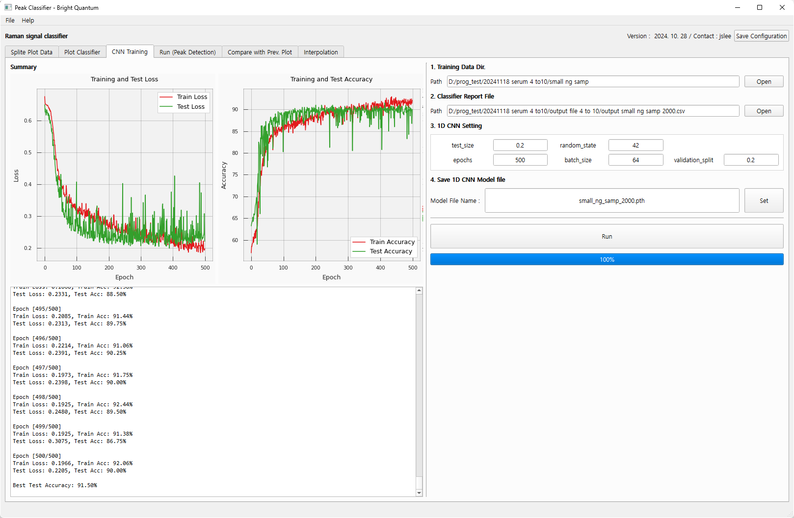

### 5. Prediction (`Run (Peak Detection)`)

학습된 모델(`.pth`)로 Peak 유무를 예측합니다.  
Best accuracy, Total / Positive / Negative count를 확인합니다.

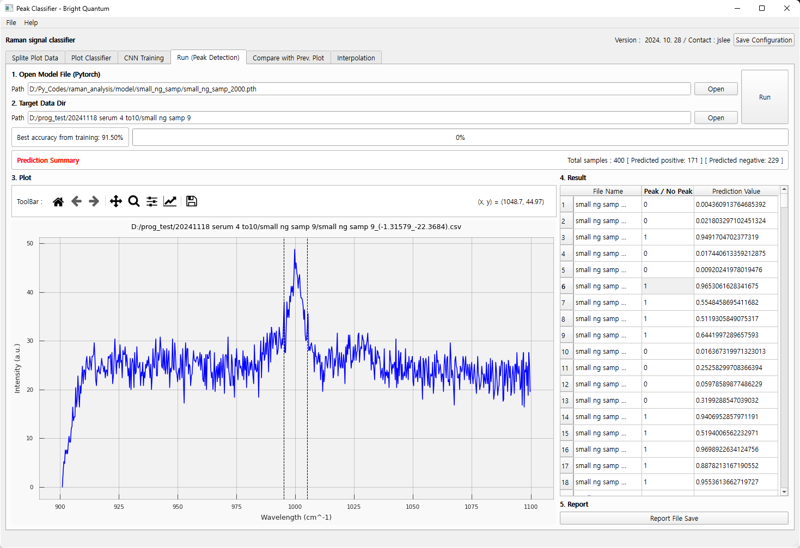

### 6. Comparison with AI and Worker (`Compare with Prev. Plot`)

작업자 수동 분류 결과와 모델 예측 결과를 비교해 Report를 작성합니다.

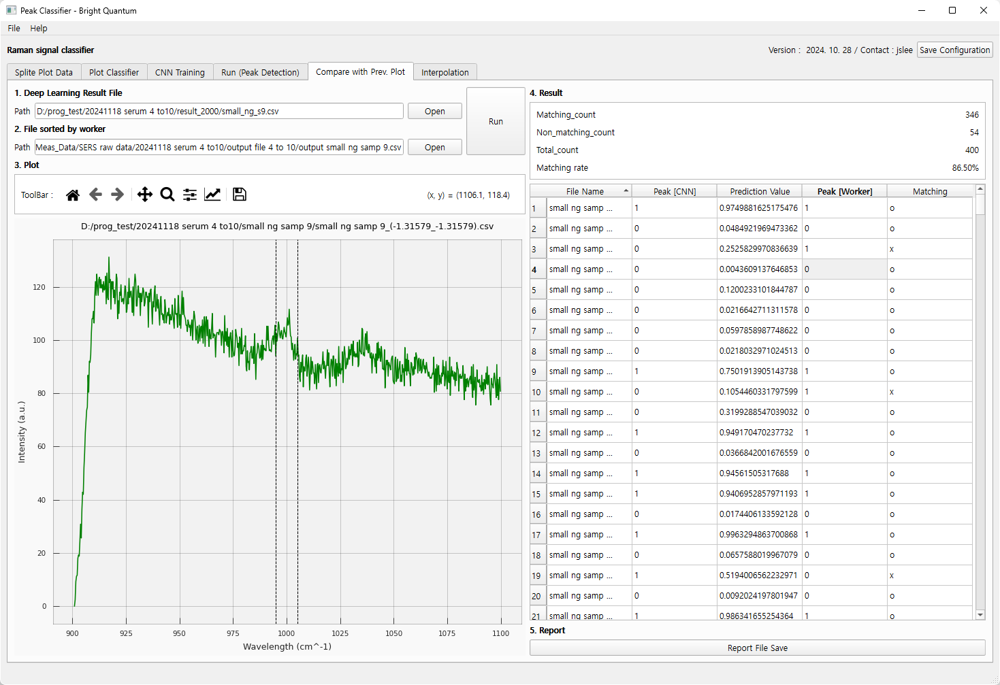

### 7. Interpolation and integration (`Interpolation`)

분류 결과를 바탕으로 피크 영역을 보간·적분하여 정량합니다.

| 항목 | 설정 |
|---|---|
| Fourier Transform | Freq. Cutoff |
| Savitzky–Golay Filter | window_length, polyorder |
| Linear Interpolation | center wavelength, span (±) |
| 결과 | Integration value → Quantification |

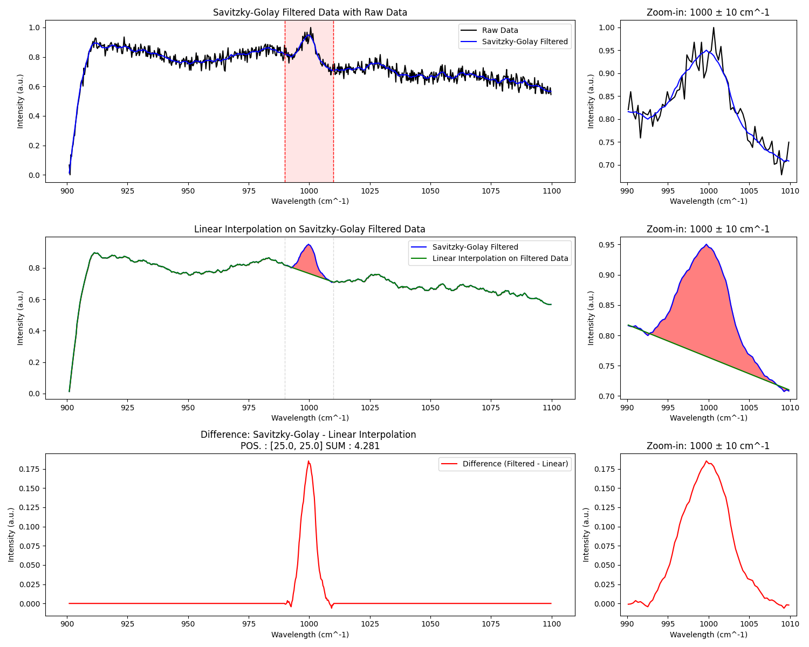

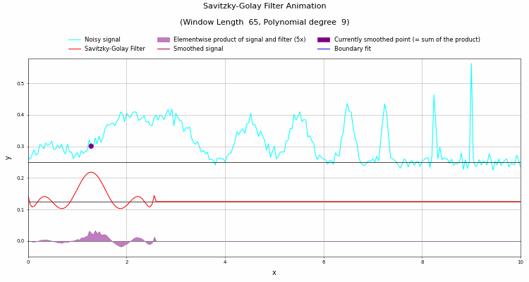

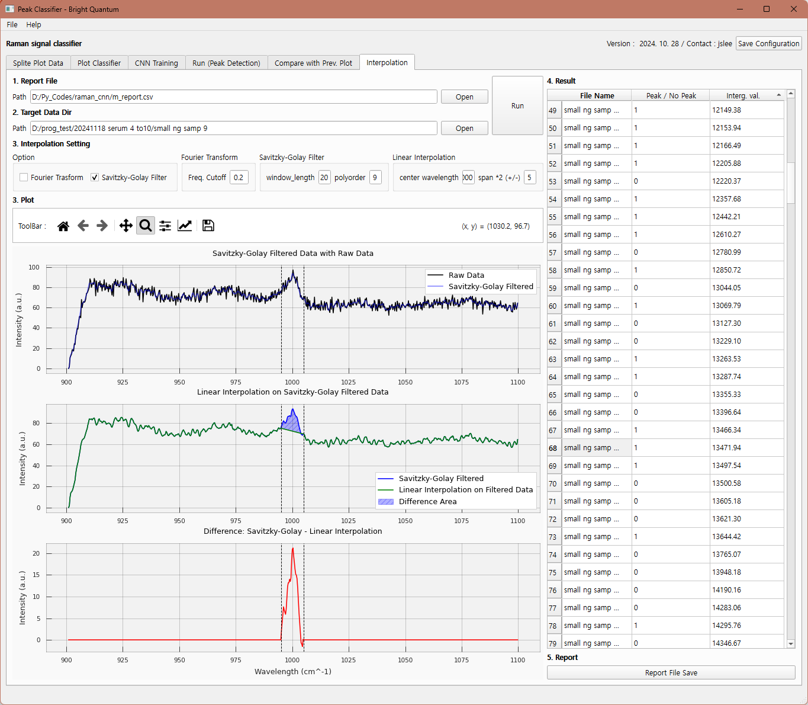

## 모델 성능 (예시)

`small ng samp 4~10` (각 400개, 합계 2800) 기준 작업자 대비 matching rate:

| Model | Matching rate (Sum) |
|---|---|
| M4 | 96.07% |
| M5 | **97.00%** |

- M0: 초기 모델
- M5: 갱신 모델 (Matching rate ≈ 97%)

사전 학습 가중치(`*.pth`)는 **저장소에 포함하지 않습니다.** 로컬 또는 NAS 경로에서 관리하세요.

## 요구 사항

- Windows 10+
- Python 3.8+
- `PyQt6`, `numpy`, `pandas`, `torch`, `scipy`, `matplotlib`, `scikit-learn`, `natsort`, `torchsummary`, `qbstyles`

## 설치 및 실행

```bash
python -m venv .venv
.venv\Scripts\activate
pip install PyQt6 numpy pandas torch scipy matplotlib scikit-learn natsort torchsummary qbstyles
python main.py
```

경로·하이퍼파라미터는 `config.ini`에 저장됩니다. (`split` / `classify` / `train` / `detect` / `compare` / `integration`)

## 주요 파일

| 파일 | 설명 |
|---|---|
| `main.py` | GUI 진입점 및 탭 로직 |
| `ui_main.py` / `ui_main.ui` | Qt Designer UI |
| `touch_training.py` | 데이터셋·모델·학습/평가 |
| `matplotlibwidget.py` | 스펙트럼 플롯 위젯 |
| `config.ini` | 경로·파라미터 설정 |
| `screenshot/` | `raman_spectrum.pptx`에서 추출한 UI·데이터 스크린샷 |
| `raman_spectrum.pptx` | 분석 흐름·모델 업데이트 정리 자료 |

## 스크린샷 목록

| 파일 | 내용 |
|---|---|
| `01_spectrum_raw_dataframe.png` | 원본 mapping dataframe |
| `02_data_separation_files.png` | 좌표별 분리 CSV |
| `03_plot_classifier.png` | 수동 피크 분류 UI |
| `04_model_summary.png` | 모델 레이어 summary |
| `05_model_concept.jpeg` | 모델 개념도 |
| `06_cnn_training_gui.png` | 학습 UI (loss/accuracy) |
| `07_prediction.png` | 예측(Peak Detection) UI |
| `08_compare_ai_worker.png` | AI vs Worker 비교 UI |
| `09_interpolation_methods.png` | SG 필터 + 선형 보간 과정 |
| `10_interpolation_demo.gif` | 보간 데모 애니메이션 |
| `11_interpolation_gui.png` | Interpolation 탭 UI |

## 참고 자료

- `raman_spectrum.pptx` — Raman spectrum / Model update & Interpolation (2025.02.03, Lee Jeong-su)
